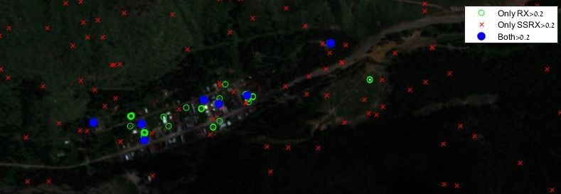

# Comparing RX and SSRX Algorithms
The repository contains part of my project for the course:
Selected Topics in Images Processing, [Prof. Stanley Rotman](http://www.ee.bgu.ac.il/~srotman/)

The goal of this project is to compare two anomaly detection algorithms for hyperspectral images – the RX algorithm and its subspace projection variation known as the SSRX algorithm. While these two algorithms are mathematically and logically similar, the different results achieved when applying them on real data are interesting to research.

In order to

## Datasets

1. 
2. 

## Disclaimer
The PCA projection used in this project was:

where the correct formula is:

## License
[MIT](https://choosealicense.com/licenses/mit/)
