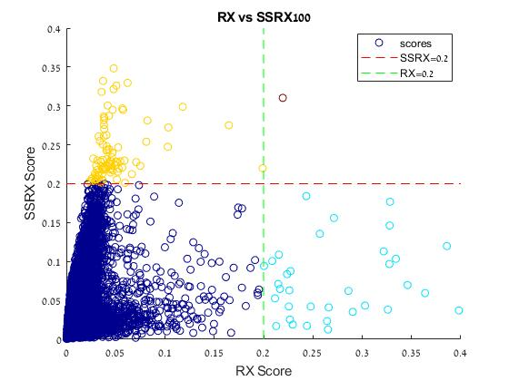

# Comparing RX and SSRX Algorithms
The repository contains part of my project for the course:
Selected Topics in Images Processing, [Prof. Stanley Rotman](http://www.ee.bgu.ac.il/~srotman/)

The goal of this project is to compare two anomaly detection algorithms for hyperspectral images – the RX algorithm and its subspace projection variation known as the SSRX algorithm. While these two algorithms are mathematically and logically similar, the different results achieved when applying them on real data are interesting to research.

In order to further examine the effects of subspace projection, it was also tested in the task of change detection using the Chronochrome algorithm.

## Repo Usage
This project was mostly based on implementing the 2 algorithms, running multiple experiments and performing exploratory data analysis. These are organized in the following folders:
- [docs](docs): Contains the full project report as well as a presentation (for those of you who are too lazy to read and want the pretty pictures)
- [code](code): Contains the main .mlx files (along with tex and pdf versions for those without access to MATLAB) and some .m helper scripts.

## Datasets Used
The data used for this project can be found here:
1. [RIT Target Detection Blind Test](http://dirsapps.cis.rit.edu/blindtest/)
2. [CiTIUS Change Detection Dataset](https://gitlab.citius.usc.es/hiperespectral/ChangeDetectionDataset)

Hyperspectral Toolbox for MATLAB (contains useful operators, transformations and algorithms):
[HyperToolbox](https://github.com/isaacgerg/matlabHyperspectralToolbox)

## Disclaimer
This project included a slight change to the PCA formula. While this may not affect the results dramatically, this is worth noting for future research purposes.
The PCA projection used in this project was:

where the correct formula is:

## License
[MIT Open Source](https://choosealicense.com/licenses/mit/)
Feel free to use this work as long as you refrence this repo.
Contact: doronser@post.bgu.ac.il
